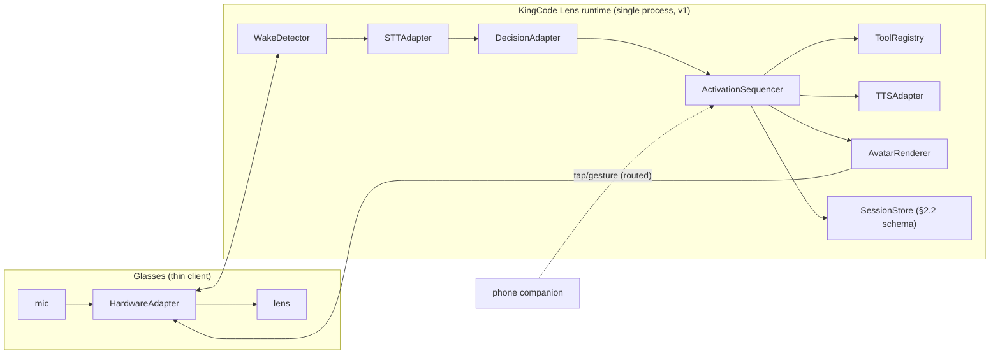

# KingCode Lens

Invocable on-eyewear agent — **"Hey KingCode"** on smart glasses. A thin-client voice loop: wake detection → listening → thinking → speaking/confirming, with a glanceable avatar rendered on the lens.

Built by the CWI agent company (ATHENA lane, 2026-09-18). Zero dependencies, $0.

## What it is

`KingCode Lens` is the software stack that lets someone invoke the KingCode agent from eyewear:

- **HardwareAdapter** — one conformance-tested interface, three backends:
  - `brilliant-labs` — full-loop path: custom "Hey KingCode" wake word + on-glasses mic + 640×400 OLED display (**simulated** transport in v1)
  - `meta-display` — **display-first**: 600×600 additive display; the web path exposes no on-glasses mic, so `captureAudio()` yields phone-companion-mic chunks relayed via cloud (**simulated**); activation is companion-signaled (tap/gesture)
  - `android-xr` — declared stub (capabilities answered, transport not implemented)
- **Voice pipeline** — WakeDetector (streaming KWS contract) → STTAdapter → DecisionAdapter (local $0 classifier mirroring `cwi-voice-command`'s decision shape) → TTSAdapter (deterministic PCM16 synthesis)
- **AvatarStateMachine** — legal transitions enforced, illegal ones throw, every transition emits `{from, to, ts, reason}`
- **AvatarRenderer** — self-contained SVG frames per state, dark `#000`, high contrast, monotonic `frame.seq` per connection (BLE drop detection)
- **ActivationSequencer** — the full loop; destructive tools **always** confirm; confirm/deny are session events for threshold calibration
- **SessionStore + ToolRegistry** — in-process v1, adopting the durable `§2.2` event schema + idempotency keys from day one

## Architecture



Activation sequence: `idle → listening → thinking → speaking|confirming → idle`.
Effective confidence bar: `max(global threshold, adapter.recommendedThreshold)`.

## Quickstart (< 1 min)

```bash
npm test          # 82 conformance + behavior tests, all green
npm run demo      # serve the lens simulator at http://localhost:8080
```

Or open the hosted simulator (everything labeled **SIMULATOR**):
**https://cumulativewebinc.github.io/cwi-glassface/**

Type a command (or use the browser's speech input), tap **Companion tap → ask KingCode** (or simulate "Hey KingCode" on the BrilliantLabs backend), and watch the avatar move through the activation states on the 600×600 lens. Destructive commands (`dismiss all`) always ask first; ambiguous ones confirm; denies and timeouts return to idle.

## Interface contract

The canonical contract is `spec/INTERFACES.md` (coordinator-held, v1.1). Every backend passes the **same** conformance suite (`test/conformance.test.js`) — the AndroidXR stub asserts its declared not-implemented behavior.

## Honest limits (read before believing any demo)

- **Simulator only.** The transports are deterministic simulations; no tests have run on physical eyewear. No "on Meta hardware" claim until a real-hardware test.
- **No Meta partnership, endorsement, or review** — ever. Meta's Ray-Ban Display web-app path was verified (2026-09-18, against Meta's official wearables docs) to expose **no microphone, no `getUserMedia`, no voice hooks, and no third-party assistant integration**; those live only in the native Device Access Toolkit (deferred). That is why `meta-display` is display-first with companion-relayed audio.
- **No on-hardware claims** of any kind in v1.
- **v1 is single-process.** SessionStore and ToolRegistry are in-process; the horizontal path is documented in `docs/SCALING.md` and unclaimed until its load-test gates pass.
- **STT/TTS v1 are simulation points.** STT takes deterministic text injection (browser demo maps Web Speech results onto the same path); TTS is deterministic PCM16 tone synthesis with a documented real-TTS swap point. Wake-word detection is a keyword-spotting simulation with a documented production seam.
- The custom "Hey KingCode" wake word ships only if it passes the week-4 false-accept gate; otherwise v1 falls back to companion-tap.
- Invention notes are **defensive disclosure, not a patent**.

## Layout

```
src/            ESM modules, zero deps (also run in the browser demo)
test/           node --test suite: conformance + state machine + pipeline + sequencer
docs/           GitHub Pages lens simulator (SIMULATOR-labeled) + SCALING.md
tools/          build-demo.mjs (emits docs/vendor/src) + serve-demo.mjs ($0 static server)
spec/           coordinator-held interface contract (copy)
```

## License

Apache-2.0 (see `LICENSE`). Commercial licensing: `COMMERCIAL-LICENSE.md`.

Copyright 2026 Cumulative Web Inc.
