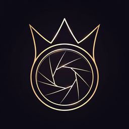

<p align="center">
  
</p>

<h1 align="center">KingCode Lens</h1>
<p align="center"><strong>v1.0.0</strong></p>
<p align="center"><em>Web apps for Meta Ray-Ban Display glasses — previewed in your browser, no hardware needed.</em></p>

<p align="center">
  
  
  
</p>

<p align="center">
  <a href="https://cumulativewebinc.github.io/cwi-kingcode-lens/">Live simulator</a> ·
  <a href="https://github.com/CumulativeWebInc/cwi-kingcode-lens/releases/tag/v1.0.0">Download v1.0.0</a> ·
  <a href="docs/licensing.md">Licensing</a> ·
  <a href="docs/quickstart.md">Quickstart</a> ·
  <a href="docs/VERIFICATION-2026-09-18.md">Verification report</a>
</p>

---

KingCode Lens is the CWI software stack for building and previewing web apps
for Meta Ray-Ban Display glasses — plus an invocable on-eyewear voice agent
("Hey KingCode") with a glanceable avatar rendered on the lens. Everything
runs in the browser simulator: no glasses, no hardware, no Meta partnership
required.

Built by Cumulative Web Inc (ATHENA lane, 2026-09-18). Zero dependencies, $0.

## Features

- **Simulator lab** — a hardened in-repo harness mirroring Meta's official
  Ray-Ban Display simulator: 600×600 additive display (black = transparent),
  environment backgrounds (built-in scenes, custom upload, animated,
  webcam), D-pad input (on-screen pad + physical arrow keys), app/background
  brightness, blur, auto-dimming, and a 600×600 WebM viewport recorder.
- **QA checklist** — one-click automated checks mirroring the official
  extension: viewport surface, favicon, D-pad focusables, overflow, visible
  focus styles, additive-dark backdrop, type sizes, tap targets, plus a
  0–100 performance score with improvement prompts.
- **HardwareAdapter** — one conformance-tested interface, three backends:
  - `meta-display` — **display-first**: 600×600 additive display; the web
    path exposes no on-glasses mic, so `captureAudio()` yields
    phone-companion-mic chunks relayed via cloud (**simulated**); activation
    is companion-signaled (tap/gesture)
  - `brilliant-labs` — full-loop path: custom "Hey KingCode" wake word +
    on-glasses mic + 640×400 OLED display (**simulated** transport in v1)
  - `android-xr` — declared stub (capabilities answered, transport not
    implemented)
- **Voice pipeline** — WakeDetector (streaming KWS contract) → STTAdapter →
  DecisionAdapter (local $0 classifier) → TTSAdapter (deterministic PCM16
  synthesis).
- **AvatarStateMachine + AvatarRenderer** — legal transitions enforced,
  illegal ones throw, every transition emits `{from, to, ts, reason}`;
  self-contained SVG frames per state, dark `#000`, high contrast.
- **ActivationSequencer** — the full loop; destructive tools **always**
  confirm; confirm/deny are session events for threshold calibration.
- **SessionStore + ToolRegistry** — in-process v1, adopting the durable
  `§2.2` event schema + idempotency keys from day one.

## Quickstart (< 1 minute)

Open the hosted simulator (everything labeled **SIMULATOR**):

**https://cumulativewebinc.github.io/cwi-kingcode-lens/**

1. Type a command (or use the browser's speech input).
2. Tap **Companion tap → ask KingCode** (or simulate "Hey KingCode" on the
   BrilliantLabs backend).
3. Watch the avatar move through the activation states on the 600×600 lens.

Destructive commands (`dismiss all`) always ask first; ambiguous ones
confirm; denies and timeouts return to idle.

### From source

```bash
npm test          # 117 conformance + behavior tests, all green
npm run demo      # serve the lens simulator at http://localhost:8080
```

Full guide: [`docs/quickstart.md`](docs/quickstart.md) ·
Simulator lab: [`docs/simulator-lab.md`](docs/simulator-lab.md) ·
QA checklist: [`docs/qa-checklist.md`](docs/qa-checklist.md)

## Interface contract

The canonical contract is `spec/INTERFACES.md` (coordinator-held, v1.1).
Every backend passes the **same** conformance suite
(`test/conformance.test.js`) — the AndroidXR stub asserts its declared
not-implemented behavior.

## Honest limits (read before believing any demo)

- **Simulator only.** The transports are deterministic simulations; no tests
  have run on physical eyewear. No "on Meta hardware" claim until a
  real-hardware test.
- **No Meta partnership, endorsement, or review** — ever. Meta's Ray-Ban
  Display web-app path was verified (2026-09-18, against Meta's official
  wearables docs, wearables.developer.meta.com/docs/develop/webapps/build/)
  to expose no microphone — verbatim: **"Web Apps do not yet support:
  Camera, Microphone, Notifications"**. No `getUserMedia`, no voice hooks,
  no third-party assistant integration; those live only in the native Device
  Access Toolkit (deferred). That is why `meta-display` is display-first
  with companion-relayed audio. Web inputs are Neural Band/captouch →
  arrow-key + Enter D-pad events and EMG pinch/drag; every on-lens element
  must be `.focusable`.
- Full per-vendor lab verification: `docs/VERIFICATION-2026-09-18.md`.
- **No on-hardware claims** of any kind in v1.
- **v1 is single-process.** SessionStore and ToolRegistry are in-process; the
  horizontal path is documented in `docs/SCALING.md` and unclaimed until its
  load-test gates pass.
- **STT/TTS v1 are simulation points.** STT takes deterministic text
  injection (browser demo maps Web Speech results onto the same path); TTS is
  deterministic PCM16 tone synthesis with a documented real-TTS swap point.
  Wake-word detection is a keyword-spotting simulation with a documented
  production seam.
- The custom "Hey KingCode" wake word ships only if it passes the week-4
  false-accept gate; otherwise v1 falls back to companion-tap.
- Invention notes are **defensive disclosure, not a patent**.

## Layout

```
src/            ESM modules, zero deps (also run in the browser demo)
test/           node --test suite: conformance + state machine + pipeline + sequencer
docs/           GitHub Pages lens simulator (SIMULATOR-labeled) + guides
tools/          build-demo.mjs (emits docs/vendor/src) + serve-demo.mjs ($0 static server)
spec/           coordinator-held interface contract (copy)
assets/logo/    official product logo (SVG master + PNG 512/256/128/64)
```

## License

**KingCode Lens Software License v1.0** (see [`LICENSE`](LICENSE)) —
proprietary, © 2026 Cumulative Web Inc.

- **Free** for personal use, development, and evaluation.
- **Paid commercial license required** for production use, products you sell,
  or revenue-generating services.
- No redistribution without written permission.

Plain-language guide: [`docs/licensing.md`](docs/licensing.md).
Commercial licensing: **hp@cumulativeweb.com**.

## Support

- Issues: https://github.com/CumulativeWebInc/cwi-kingcode-lens/issues
- Business & licensing: hp@cumulativeweb.com
- Web: https://cumulativeweb.com

Copyright 2026 Cumulative Web Inc. All rights reserved.
